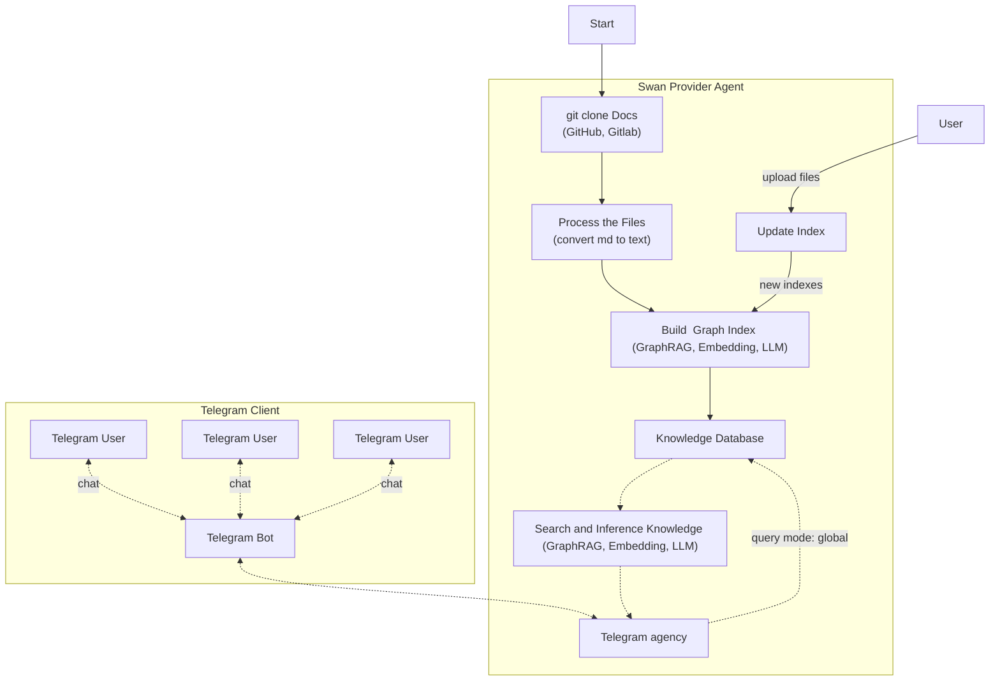

# Swan Provider Agent 
SwanChain Telegram Bot with GraphRAG & Meta Llama3

This project implements a Telegram bot that allows users to ask questions about SwanChain. The bot uses Microsoft GraphRAG to build a knowledge graph (index) from SwanChain GitBook documentation and then leverages Meta Llama3 to generate answers enriched with context.

The workflow is as follows:

1. **Repository Management:**  
   The bot clones (or updates) the SwanChain GitBook repository from GitHub.

2. **Markdown Conversion:**  
   All Markdown files from the repository are converted to plain-text files and saved under `./ragtest/input`.

3. **GraphRAG Indexing:**  
   The bot loads configuration from `settings.yaml` and uses Microsoft GraphRAG to build an index from the converted text files.  
   *The index is built only once (or when forced) and reused across restarts.*

4. **Querying:**  
   When a user asks a question via Telegram, the bot queries the pre-built index to retrieve enriched context.

5. **Answer Generation:**  
   The enriched context is combined with the user's question to form a prompt. This prompt is then sent to the Meta Llama3 endpoint (with retry and exponential backoff) to generate a final answer.

6. **Telegram Integration:**  
   The bot is built using the `python-telegram-bot` library (v20+). Users can interact with the bot via Telegram, and it replies with the generated answer.

## Features

- **Efficient Indexing:**  
  Uses GraphRAG to index documentation once and reuse it across sessions.
  
- **Rich Context Retrieval:**  
  Retrieves enriched context from the index to help generate more informed answers.
  
- **Meta Llama3 Integration:**  
  Calls a Meta Llama3 endpoint to generate answers based on the combined prompt.
  
- **Asynchronous and Parallel Processing:**  
  Uses asyncio and supports concurrency control with logging and retry mechanisms.
  
- **Telegram Bot Interface:**  
  Users can ask questions directly through Telegram.

## Architecture



## Prerequisites

- **Python 3.10+**
- **Git** (for cloning the documentation repository)
- Required Python packages:
  - `asyncio`
  - `nest_asyncio`
  - `python-telegram-bot` (v20+)
  - `pyyaml`
  - `requests`
  - `pandas`
  - `Markdown`
  - `python-dotenv`
  - `requests`
  - `regex`
  - `llama-index`
  - `graspologic`
  - `numpy`
  - `scipy`
  - `graphrag`
  - `fastapi`
  - `telegramify-markdown`
  - `python-multipart`
  - `pipmaster`
  - `openai`
  - `uvicorn`

## Installation

1. **Clone this Repository:**

   ```bash
   git clone https://github.com/FogMeta/swan-provider-agent.git
   cd swan-provider-agent
   ```

2. **Set Up a Virtual Environment:**

   ```bash
   python3 -m venv venv
   source venv/bin/activate  # On Windows: venv\Scripts\activate
   ```

3. **Install Dependencies:**

   ```bash
   pip install -r requirements.txt
   
   ```

4. **Configure Environment Variables:**

   Create a `.env` file in the project root with the following variables:
   ```
    TEST_MODE=False
    FORCE_BUILD_GRAPH=False
    WORK_DIRECTORY="ragtest"
    REPO_URL="your git repo url"
    TELEGRAM_BOT_TOKEN="your_telegram_bot_token_here"
    
    LLM_API_KEY="your_llm_api_key"
    LLM_MODEL="llm_model"
    LLM_API_BASE="llm_api_base_url"
    
    EMBEDDING_API_KEY=""
    EMBEDDING_MODEL="togethercomputer/m2-bert-80M-2k-retrieval"
    EMBEDDING_API_BASE="embedding_api_base_url"
   ```

5. **Configure GraphRAG[Manual index building(optional)]:**
```
   graphrag init --root ./ragtest
```
 add the GRAPHRAG_API_KEY to .env

## Configuration for Testing

To facilitate testing, a separate directory is used to store test files. This allows you to quickly test the GraphRAG algorithm with a limited set of files before processing the entire dataset.

1. **Create a Test Directory:**

   Ensure that a directory named `test_input` exists within your project directory. This directory will be used to store files specifically for testing purposes.

   ```bash
   mkdir -p ./ragtest/test_input
   ```

2. **Add Test Files:**

   Place the files you wish to use for testing into the `test_input` directory. By default, the system will use the first two files in this directory when test mode is enabled.

3. **Start agent server:**
   ```
   python agent.py >> server.log 2>&1 &
   ```
4. Upload a file and the index will be automatically built incrementally
   ```
   curl -X POST "http://127.0.0.1:8000/upload_file" -H "Content-Type: multipart/form-data" -F "file=@<file_path>.txt"
   ```
5. Query

    ```
    curl -X POST "http://127.0.0.1:8000/query" -H "Content-Type: application/json" -d '{"query": "how to build app and build image", "mode": "global"}'
    ```

## Usage

1. **Run the Telegram Bot in Test Mode:**

   To run the bot in test mode, which uses only the files in the `test_input` directory, set the `test_mode` flag to `True` when calling the `build_and_query_index` function.

   ```python
   python telegram_bot.py >> telegram.log 2>&1 &
   ```

2. **Interact via Telegram:**
    - Open Telegram and start a chat with your bot.
    - Use the `/start` command for a welcome message.
    - Send any question about SwanChain and mention it , and the bot will process your query using the GraphRAG pipeline and reply with a generated answer.

## How It Works

- **Repository & Conversion:**  
  The bot updates or clones the SwanChain GitBook repository, converts all Markdown files to plain text (stored under `./ragtest/input`).

- **GraphRAG Indexing:**  
  It loads configuration from `settings.yaml` (located in `./ragtest`), builds the index using Microsoft GraphRAG if it isn't already built (or if forced), and logs detailed progress for each workflow step.

- **Querying & Answer Generation:**  
  The index is queried to retrieve enriched context, which is then combined with the user's question to form a prompt. This prompt is sent to Meta Llama3 to generate an answer.

- **Telegram Bot Integration:**  
  The bot, built using `python-telegram-bot`, listens for user questions and replies with the generated answer.

## Troubleshooting

- **Indexing Errors:**  
  Check the logs for errors during index building or global search.
- **API Rate Limits:**  
  If you encounter HTTP 429 or 524 errors, adjust the concurrency settings or retry delays.
- **Configuration Issues:**  
  Ensure that your `settings.yaml` is correctly formatted and all required fields are set.

## License

This project is licensed under the MIT License. See the [LICENSE](LICENSE) file for details.

## Acknowledgments

- Microsoft GraphRAG for the underlying indexing and retrieval API.
- OpenAI and Azure for their LLM services.
- Contributors to the python-telegram-bot library.

